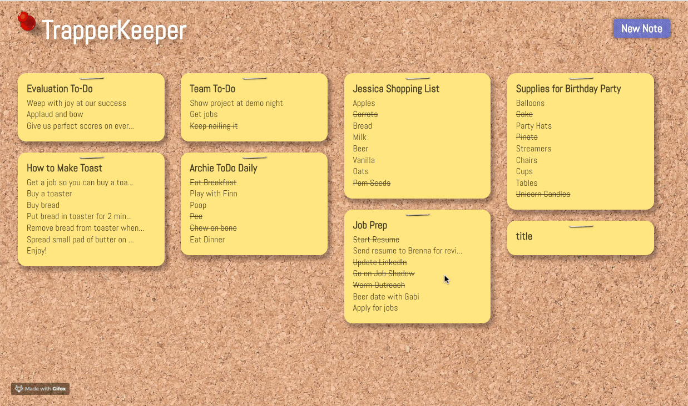
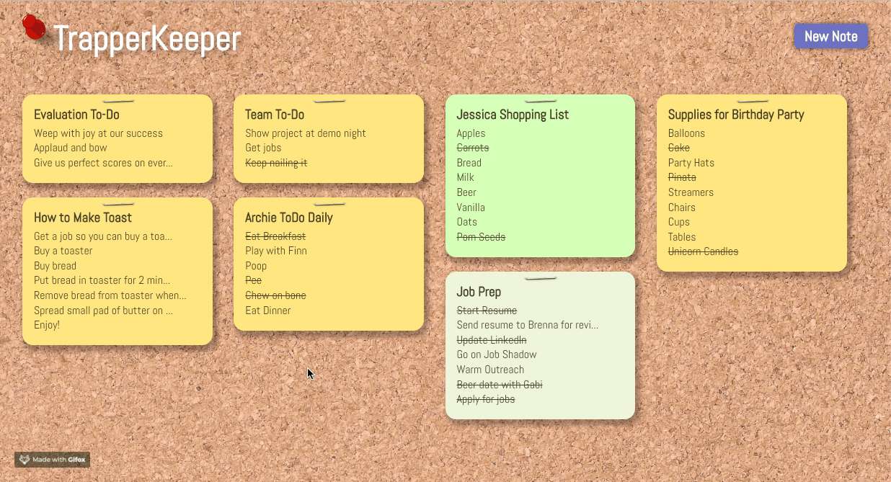

# TrapperKeeper

## Descriptions:

TrapperKeeper is a group project based on the user functionality of Google Keep. You can add and save notes. Notes can also be edited, list items marked as completeted, and the background color of the note can be changed. 

TrapperKeeper was built using: HTML, JavaScript, SCSS, React, React-Router, Redux, Node.js, and Express.


## Preview:






## Getting Started:

These instructions will get a copy of the project up and running on your local machine for usage and testing purposes.

### Frontend
clone down the repo: ```$ git clone https://github.com/MRKrog/TrapperKeeper```

cd into directory and run npm install: ```$ npm install```

launch in your browser: ```$ npm start ```

### Backend
clone down the repo: ```$ git clone https://github.com/MRKrog/TrapperKeeper-api```

cd into directory and run npm install: ``` $ npm install ```

launch in your browser: ``` $ npm start ```


## Future Development and Extensions Notes:

-Easier keyboard only flow on note (ie. ability to press Enter to get to next line) \
-Add drag and drop functionality for notes \
-Add ability to search notes \
-Add ability to upload files or pictures to notes


## Original Assignment
[TrapperKeeper, Mod 3 at the Turing School of Software and Design](http://frontend.turing.io/projects/trapper-keeper.html)


## Contributors
David Cisneros: https://github.com/DevelopingDavid \
Jessica Hansen: https://github.com/jessicalyn \
Jake Admire: https://github.com/JakeAdmire \
Michael Krog: https://github.com/MRKrog/
